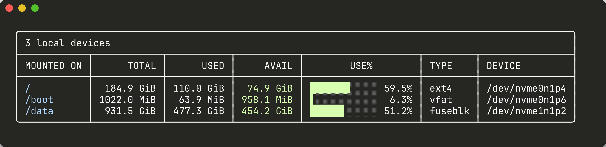

# dfpp

**A pretty disk usage CLI utility for Linux, inspired by [duf](https://github.com/muesli/duf), written in C++23.**



## Features

- Human-readable sizes (B / KiB / MiB / GiB / TiB)
- Unicode progress bars (`█▌░`) with color-coded usage levels
- 256-color ANSI — consistent look across terminal themes
- Box-drawn table with auto-sized columns
- Automatic filtering of pseudo-filesystems and duplicate mounts
- Directory arguments with longest-prefix mount matching
- No external dependencies — pure C++ standard library and POSIX

## Build

```bash
make
```

Requires GCC with C++23 support (GCC 14+).

## Usage

```bash
./dfpp                  # all real filesystems
./dfpp /data .          # only the filesystems owning these paths
./dfpp ~/projects       # relative and absolute paths both work
```

## How it works

Reads `/proc/mounts`, calls `statvfs()` on each real block device, and renders the results in a single formatted table.

```
/proc/mounts → parse → filter → statvfs() → format → render
```

## Project structure

```
types.hpp        FileSystemInfo data model
fs_info.hpp/cpp  mount parsing, statvfs, filtering, path matching
format.hpp/cpp   size formatting, color codes, progress bars
table.hpp/cpp    box-drawn table rendering
main.cpp         CLI driver
```

## TODO

- [ ] CLI flags for size units, showing all filesystems, disabling color, JSON output
- [ ] Sorting by size, usage, name
- [ ] macOS support

## Linux only (for now)

`dfpp` reads `/proc/mounts`, which is Linux-specific.
